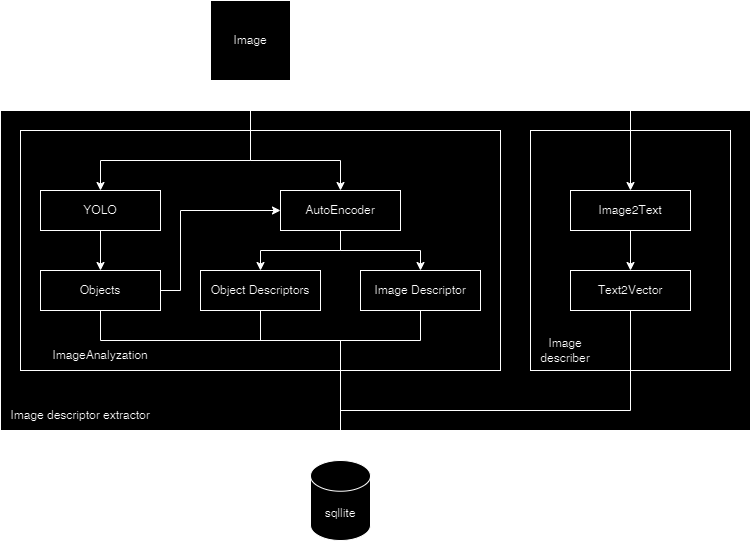
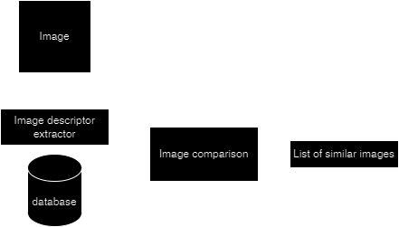
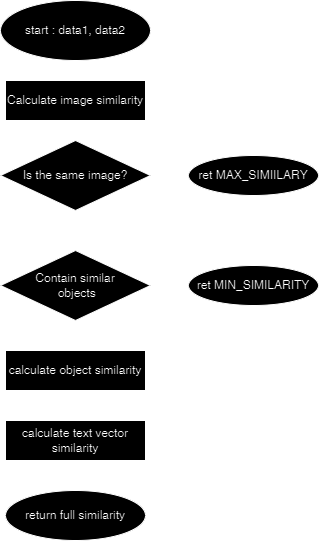

# Kimaris : Reverse Image Search

This app can be used to search for images locally. (From the indexed folders)
Two search methods are:
 - Searching with text
 - Reverse image search

Can search through videos. Find an object in a video. Reverse image search in videos.

#### Running the app

Firstly add the folders you want to search through. Amount of time for the folder indexing depends on number of images and videos.
Then you can search through the folders using the app.

### How does it work

#### Extracting image data

Images pass through the YOLO model, that return objects and bounding boxes from the image. Image gets cut and all of the objects from the image get pass through the AutoEncoder encoder. The result is a code.
Image also gets passed though the AutoEncoder encoder.
Image gets described by the Image2Text model and that description gets vectorized by the Text2Vector.
Resulting information is stored in the database.

#### Comparing images

The input image gets passed through the image descritor extractor (previous text), and resulting information is comapred.

The comparison is shown in the following diagram:

### Creating the enviroment
conda create --name app python=3.11 
conda activate app

### Instaling with pip (recommended)

pip install opencv-python

<b> Note </b>: Installing torch using the command on the pytorch website : [pytorch](https://pytorch.org/)

pip install torch torchvision torchaudio --index-url https://download.pytorch.org/whl/cu118

pip install ultralytics

<b>Note</b> : Maybe not necessary

pip install PyQt5

pip install gensim

pip install git+https://github.com/huggingface/transformers

pip install gdown

### Instaling with conda
conda install -c conda-forge opencv

<b> Note </b>: Installing torch using the command on the pytorch website : [pytorch](https://pytorch.org/)

conda install pytorch torchvision torchaudio pytorch-cuda=11.8 -c pytorch -c nvidia

conda install -c conda-forge ultralytics

<b>Note</b> : Maybe not necessary

conda install -c anaconda pyqt

pip install gensim

pip install git+https://github.com/huggingface/transformers

pip install gdown

### Install codecs

https://www.codecguide.com/download_k-lite_codec_pack_basic.htm

#### Searching capabilities

#### Reverse image search : images

