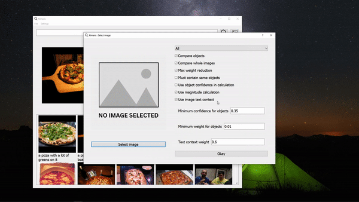
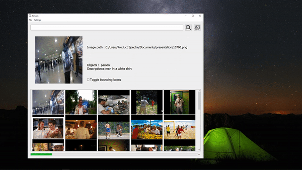

# Kimaris : Reverse Image Search

This app can be used to search for images locally. (From the indexed folders)

### Creating the enviroment
conda create --name app python=3.11 
conda activate app

### Instaling with pip (recommended)

pip install opencv-python

<b> Note </b>: Installing torch using the command on the pytorch website : [pytorch](https://pytorch.org/)

pip install torch torchvision torchaudio --index-url https://download.pytorch.org/whl/cu118

pip install ultralytics

<b>Note</b> : Maybe not necessary

pip install PyQt5

pip install gensim

pip install git+https://github.com/huggingface/transformers

pip install gdown

### Instaling with conda
conda install -c conda-forge opencv

<b> Note </b>: Installing torch using the command on the pytorch website : [pytorch](https://pytorch.org/)

conda install pytorch torchvision torchaudio pytorch-cuda=11.8 -c pytorch -c nvidia

conda install -c conda-forge ultralytics

<b>Note</b> : Maybe not necessary

conda install -c anaconda pyqt

pip install gensim

pip install git+https://github.com/huggingface/transformers

pip install gdown

### Install codecs

https://www.codecguide.com/download_k-lite_codec_pack_basic.htm

#### Searching capabilities

#### Reverse image search : images

